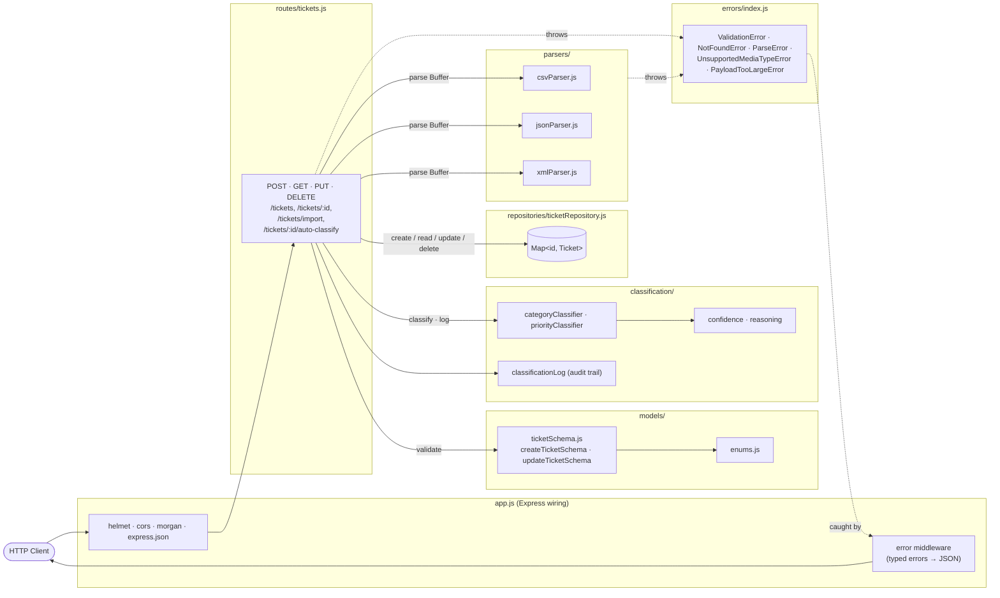
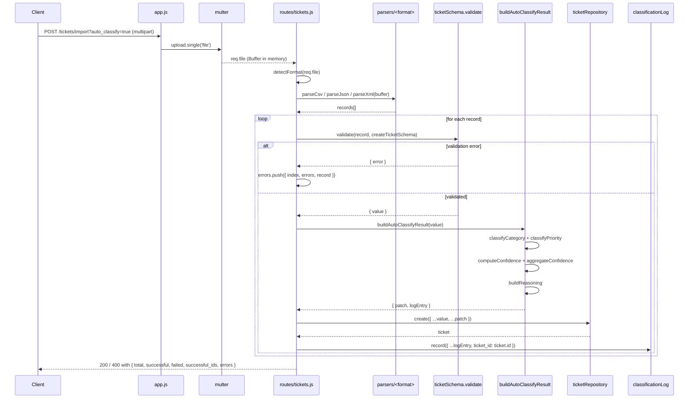

# Architecture

This document describes the design of the Intelligent Customer Support Ticket System. It is aimed at technical leads and contributors who need to understand *why* the system is shaped the way it is — where the seams are, what's intentional, and where to land changes.

For endpoint specifications see `API_REFERENCE.md`. For the test suite and how to run it see `TESTING_GUIDE.md`. For installation and project layout see `README.md`.

## What this system is — and isn't

It is a Node.js / Express REST API that ingests customer-support tickets from CSV, JSON, or XML files; validates them against a canonical schema; auto-classifies each ticket's category and priority via keyword scoring; and keeps an audit log of every classification decision. Storage is in-memory (`Map<id, Ticket>`) and the system is single-process.

It is **not** a production system. It deliberately omits authentication, authorization, persistent storage, rate limiting, and any input sanitization beyond Joi validation. Those omissions are scope decisions for the homework, not oversights — see "Security and performance" below.

## Layered architecture

The codebase is split into six layers. Each has one responsibility, one direction of dependency, and one file/folder under `homework-2/src/`.

Three things this diagram is meant to convey:

1. **Routes never touch the `Map` directly.** Every storage operation goes through `repositories/ticketRepository.js`. That module is the only place that imports the `Map` and the only place that has to change if storage moves to SQLite or Postgres.
2. **Parsers are pure.** They take a `Buffer` and return an array of plain ticket objects. They do not see Express, do not write to the repository, do not return HTTP responses. The bulk-import endpoint orchestrates parser → validator → repository; the parsers themselves don't know they're being called from HTTP.
3. **Errors flow back to one middleware.** Routes and parsers `throw` typed errors with a `statusCode` field. The error middleware in `app.js` is the single place that converts errors into JSON responses. There is no `res.status(400).json(...)` inside a route handler.

## Component descriptions

### `models/`

The contract layer. `enums.js` lists the five enum arrays (`CATEGORIES`, `PRIORITIES`, `STATUSES`, `SOURCES`, `DEVICE_TYPES`) — the single source of truth used by every layer. `ticketSchema.js` defines two Joi schemas: `createTicketSchema` (strict, with required fields) and `updateTicketSchema` (all-optional, with `.min(1)` to reject empty PATCHes). The `validate(payload, schema)` helper runs with `abortEarly: false` so all validation errors surface in one response, and `stripUnknown: true` so unknown keys are silently dropped.

Server-managed fields (`classification_confidence`, `classified_at`) are explicitly declared with `Joi.any().strip()` rather than relying on `stripUnknown`. That makes them visible in the schema as "known to exist, owned by the server" — a client trying to inject them is always quietly ignored.

Files: `homework-2/src/models/enums.js`, `homework-2/src/models/ticketSchema.js`.

### `repositories/`

A singleton in-memory store keyed by ticket UUID. Every method returns deep clones (`JSON.parse(JSON.stringify(...))`) so callers cannot mutate stored state. `update()` is transition-aware: when a ticket's status moves into `'resolved'` it stamps `resolved_at`; moving back out clears it. `clear()` exists solely to support the `afterEach` hook in `tests/setup.js` — production code never calls it.

The exported API (`create`, `findAll`, `findById`, `update`, `delete`, `clear`) is the swap-point for any future persistent storage. As long as a SQLite or Postgres adapter conforms to that surface, no route or test changes.

File: `homework-2/src/repositories/ticketRepository.js`.

### `routes/`

All HTTP endpoints live in one file: `homework-2/src/routes/tickets.js`. Routes are deliberately thin — they validate the request, dispatch to the right collaborator (repo, parser, classifier), and serialize the response. Errors are *thrown*, never inlined as `res.status(...).json(...)`.

Two helpers reduce duplication:

- `assertUuid(id)` — throws `ValidationError` if the path parameter isn't a UUID v4. Reused by GET, PUT, DELETE, and `/auto-classify`.
- `buildAutoClassifyResult(validated)` — runs both classifiers, computes aggregate confidence, applies per-axis manual-override precedence, and returns `{ patch, logEntry }`. Used by both `POST /tickets?auto_classify=true` and `POST /tickets/import?auto_classify=true`. Without this helper the two endpoints would either duplicate ~30 lines or drift out of sync.

### `parsers/`

Three pure functions, each with the same shape: `(Buffer) → array of plain ticket objects`. CSV uses `csv-parse/sync` and folds flat columns named `metadata.source`, `metadata.browser`, `metadata.device_type` into a nested `metadata` object; the `tags` column is split on `|`. JSON wraps a single object into a one-element array (so a client can post either form). XML uses `xml2js` with `explicitArray: false` and normalizes its quirks: a single `<ticket>` child becomes a one-element array, a single `<tag>` becomes a one-element array, nested `<metadata>` becomes a JS object.

All three throw `ParseError('Malformed <format>: ...')` on syntax errors. The bulk-import route catches *validation* errors per-row, but lets `ParseError` propagate to the centralized error middleware so the whole file is rejected with a 400.

Files: `homework-2/src/parsers/{csvParser,jsonParser,xmlParser}.js`.

### `classification/`

Rule-based, not ML. Two parallel classifiers — `categoryClassifier.js` and `priorityClassifier.js` — share a keyword matcher (`matcher.js`) and dictionaries (`keywords.js`). The matcher uses regex word boundaries (`\bkeyword\b`) for single-word keywords and substring matching for multi-word phrases (which can include apostrophes like `"can't access"`).

Each classifier returns `{ category | priority, score, matchedKeywords, scoresBy<axis> }`:

- **`score`** is the *total occurrence count* across all matched keywords (so repeated mentions strengthen the signal).
- **`matchedKeywords`** is the *distinct* set, used for confidence and reasoning.

`confidence.js` exports `computeConfidence(matchedKeywords)` (returns `min(1, hits / 3)`) and `aggregateConfidence(catConf, priConf)` (simple average, used as the canonical number stored on the ticket). `reasoning.js` produces human-readable strings like `"Category 'account_access' inferred from keywords: [login, password]. Priority 'urgent' inferred from keywords: [can't access, security]."`.

Priority tie-break order is `urgent > high > low > medium` — when multiple priorities tie on score, the more urgent one wins. This biases toward escalation, which is intentional: the cost of mis-flagging a routine question as urgent is much lower than missing a real urgent issue.

`classificationLog.js` is an in-memory audit trail capped at 10,000 entries with FIFO eviction. **Every classification decision must hit this log** — auto-on-create, the explicit `/auto-classify` endpoint, and every manual override via PUT. The `source` field (`'auto_create' | 'auto_classify_endpoint' | 'manual_override'`) lets retrospective queries distinguish the three.

Files: `homework-2/src/classification/{keywords,matcher,categoryClassifier,priorityClassifier,confidence,reasoning,classificationLog}.js`.

### `errors/`

Typed `HttpError` subclasses, each carrying a `statusCode`:

| Class | Status | When |
|---|---|---|
| `ValidationError` | 400 | Joi validation failure on body, query, or UUID path param |
| `NotFoundError` | 404 | Ticket id not found |
| `ParseError` | 400 | Malformed CSV/JSON/XML during bulk import |
| `UnsupportedMediaTypeError` | 415 | Upload with no recognizable mimetype or extension |
| `PayloadTooLargeError` | 413 | Reserved for future use; multer's `LIMIT_FILE_SIZE` is currently mapped directly in the error middleware |

The error middleware in `app.js` runs in this order: (1) `express.json` body-parse failures → 400 "Malformed JSON body"; (2) multer `LIMIT_FILE_SIZE` → 413; (3) any error with a `statusCode` → that status, body `{ error: err.message, details: err.details? }`; (4) anything else → 500 with the full stack logged server-side.

File: `homework-2/src/errors/index.js`.

## Auto-classify-on-import: the most cross-cutting flow

The endpoint that touches the most layers is `POST /tickets/import?auto_classify=true`. It dispatches a parser, validates each row, classifies, persists, and logs — for every row independently:

Three properties of this flow are worth calling out:

1. **The parser runs once.** A 1,000-row CSV is parsed top-to-bottom and the rest of the loop processes plain JS objects. We never re-read the buffer.
2. **Per-row try/catch isolates failures.** A single row with a malformed email never aborts the batch — it goes into the failures list with the row's *original index*, so the client can correlate failures back to source positions.
3. **The classifier runs per row when `auto_classify=true`.** That's why P1 (1,000-row import in <5s) is a meaningful budget: if anyone ever swaps the keyword matcher for something heavier, that test catches the regression.

If the client asks for `auto_classify=false` (the default), `buildAutoClassifyResult` is skipped entirely; the classifier never runs and `classification_confidence` stays `null`.

## Design decisions and trade-offs

### 1. In-memory store with a repository seam

The homework spec doesn't require persistence, and a real DB adds operational complexity (containers, migrations, cleanup) that distracts from the actual learning goals. We use a `Map<id, Ticket>` and pay the migration cost only if and when we move beyond homework. The cost we *don't* pay: route handlers stay storage-agnostic. Swapping in SQLite or Postgres means rewriting `repositories/ticketRepository.js` and nothing else.

**Trade-off**: state is lost on every server restart, and any future multi-process deployment would be broken. Both acceptable here.

### 2. Centralized Joi validation, not ad-hoc per-route checks

Every endpoint validates against one of two schemas (`createTicketSchema` or `updateTicketSchema`). Bulk import uses the same `createTicketSchema` per row. There is no validation logic outside `models/ticketSchema.js` and route-local query schemas (themselves Joi).

`abortEarly: false` is the most important option: it surfaces all errors in a single response, so a client posting a body with three problems learns about all three at once. Without it, fixing one problem just exposes the next on the next request — a degraded UX.

### 3. Routes throw typed errors; one middleware maps them

Before Step 1.12 of the implementation plan, routes returned 4xx responses inline. The refactor that consolidates error handling into `errors/index.js` + the middleware in `app.js` had two payoffs: routes shrank, and the HTTP status code policy lives in one auditable place. Adding a new error class is now a 5-line change in `errors/index.js`; nothing in routes needs touching.

### 4. Manual override always wins over auto-classification

When a client sends `auto_classify=true` *and* explicitly specifies a `category` or `priority` in the body, the manual values win. Per-axis: manual category + auto priority is supported. The classifier still runs, the auto suggestion is still logged (with `source: 'manual_override'`), but the *stored* values reflect the human's call.

This bias is intentional. Auto-classification is a heuristic; humans correcting it is the expected steady-state, not the exception.

### 5. The classification log records the AI's recommendation, not the stored values

When a manual override happens, the log entry's `category`/`priority` fields hold what the *classifier* suggested — not what got persisted on the ticket. Why: the log is an audit trail of decisions. Future-you, asking "what was the AI thinking when this ticket was created?", needs to see the classifier's view, not the human's.

This is the kind of policy that's easy to "fix" the wrong way once and lose retroactive auditability. Test K10 in `tests/test_categorization.test.js` pins it down.

### 6. Server-managed fields stripped from incoming payloads

`classification_confidence` and `classified_at` are declared in the schemas as `Joi.any().strip()`. They accept any input and silently remove it before validation continues. Two reasons over plain `stripUnknown`:

- **The schema documents what's server-owned.** A reader of `ticketSchema.js` sees the field exists and is annotated.
- **Update `.min(1)` semantics stay correct.** A PUT body that contains *only* server-managed fields strips down to `{}`, which then trips `.min(1)` and yields the explicit `"No fields to update"` error.

### 7. Bulk import never aborts on a single bad row

The per-row loop wraps validation, classification, and persistence in a try/catch. A failure goes into a structured errors list with `{ index, errors, record }`; success goes into `successful_ids`. The response always returns the same shape: `{ total, successful, failed, successful_ids, errors }`.

The only deviation: when *every* row fails, the response uses status 400 (instead of 200) to signal total rejection — but the body shape is unchanged, so a client's parser doesn't need to branch on status code. Test C4 in `tests/test_import_csv.test.js` documents this with the `invalid_tickets.csv` fixture.

## Security and performance

### Security posture (intentional non-features)

- **`helmet()`** sets a default set of security headers. Standard.
- **`cors()`** is enabled with default open policy. **Intentional non-feature**: any origin can call any endpoint. A real deployment would constrain this to known frontends.
- **`express.json({ limit: '10mb' })`** caps JSON body size.
- **`multer.memoryStorage()` with a 10 MB limit** caps file uploads. Files never touch disk during parse.

The system has **no authentication, no authorization, no rate limiting, no per-user quotas, and no input sanitization beyond Joi**. None of this is appropriate for production; all of it is appropriate for a homework that exists to demonstrate API + classifier + test architecture. Graders should read the omissions as intentional, not as oversights.

### Performance budgets (enforced by tests)

The performance test file in `tests/test_performance.test.js` pins five budgets. Wall-clock, not CPU-time:

| Test | Budget | What it protects |
|---|---|---|
| P1 | 1,000-row CSV import < 5 s | Parser + per-row validation throughput |
| P2 | 100 sequential POSTs avg < 50 ms | Single-request latency under no load |
| P3 | 100 sequential GETs avg < 20 ms | Read-path latency, repo lookup cost |
| P4 | 100 concurrent mixed reads/writes < 10 s, 0 errors | Event-loop fairness; no race on Map writes |
| P5 | 100 sequential auto-classify avg < 100 ms | Classifier + log write throughput |

See `TESTING_GUIDE.md` for measured numbers and how to reproduce.

## Where to make changes

A short decision tree for common change requests:

| If you want to... | Edit |
|---|---|
| Add a ticket field | `homework-2/src/models/ticketSchema.js` (both schemas), maybe `enums.js` if it's an enum field. The repository's spread defaults pick up new fields automatically. |
| Add a parser format (e.g., YAML) | New file `homework-2/src/parsers/yamlParser.js`; extend `detectFormat` and `runParser` in `homework-2/src/routes/tickets.js`. |
| Add a classification keyword | `homework-2/src/classification/keywords.js`. No other change required — both classifiers re-read the dictionary on every call. |
| Change priority tie-break order | `PRIORITY_ORDER` constant in `homework-2/src/classification/priorityClassifier.js`. |
| Swap storage backend | `homework-2/src/repositories/ticketRepository.js`, preserving the exported API surface (`create`, `findAll`, `findById`, `update`, `delete`, `clear`). |
| Add a new HTTP error type | `homework-2/src/errors/index.js`; the middleware in `app.js` picks up any class with a `statusCode` automatically. |
| Add a new endpoint | `homework-2/src/routes/tickets.js`. Throw typed errors — never `res.status(...).send(...)` for error cases. |
| Add a test | `homework-2/tests/test_<area>.test.js`. The global `afterEach` in `tests/setup.js` clears `repo` and `classificationLog` for you. |
