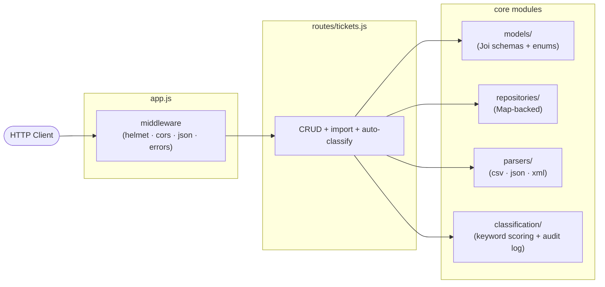

# 🎫 Homework 2: Intelligent Customer Support Ticket System

> **Student Name**: Alona Holovko
> **Date Submitted**: 09.05.2016
> **AI Tools Used**: Claude Code

---

## Project Overview

A Node.js / Express REST API that imports customer-support tickets from CSV, JSON, or XML files, validates them against a canonical schema, and auto-classifies category and priority via keyword scoring with a confidence score and audit log. Storage is in-memory (`Map<id, Ticket>`); validation is centralized in Joi; HTTP endpoints are layered behind a repository so the storage backend can be swapped without changing route handlers.

See `PLAN.md` for the step-by-step implementation plan and `TASKS.md` for the assignment spec.

### Key features

- **CRUD API for tickets** — create, list with filters and pagination, fetch, update, delete.
- **Bulk import from CSV / JSON / XML** — single `POST /tickets/import` endpoint, format detected by mimetype with extension fallback, per-row validation, structured `{total, successful, failed, errors[]}` response.
- **Auto-classification** — rule-based keyword scoring picks `category` and `priority`, computes a 0-1 confidence, and emits a human-readable reasoning string. Manual values in the body always win; the classifier's suggestion is still preserved in the audit log.
- **Audit log of every classification decision** — distinguishes `auto_create`, `auto_classify_endpoint`, and `manual_override` sources.
- **Centralized error handling** — typed errors thrown from routes, mapped to JSON responses by a single middleware (400 / 404 / 413 / 415 with consistent body shape).
- **90 Jest + Supertest tests** with **97 / 89 / 100 / 98** coverage, gated at ≥85%.

## Architecture at a glance



For the full layered diagram, sequence diagrams, and design rationale, see `ARCHITECTURE.md`.

## Quick start

```bash
cd homework-2
npm install        # first time
npm run dev        # nodemon, hot-reloads on src/ changes
# or
npm start          # plain node src/server.js (listens on PORT, default 3000)
```

## Running tests

The test suite uses Jest + Supertest, covers all 56 plan-mandated scenarios plus 34 targeted branch-coverage tests, and runs in under 5 seconds.

```bash
npm test                                       # full suite, no coverage (fast iteration)
npm run test:coverage                          # full suite + coverage report + 85% gate
npx jest tests/test_ticket_api.test.js         # one file
npx jest -t "T7"                               # one test by name fragment
npx jest --watch                               # auto-rerun on file save
```

| Script                  | What it does                                                                                          | Use when                         |
| ----------------------- | ----------------------------------------------------------------------------------------------------- | -------------------------------- |
| `npm test`              | Runs Jest on all `tests/**/*.test.js`. No coverage instrumentation.                                   | Iterating; expect ~3–4 s.        |
| `npm run test:coverage` | Same suite plus coverage report. Fails if any of statements/branches/functions/lines drops below 85%. | Before commit / CI / submission. |

After `npm run test:coverage`, an HTML report lands at `coverage/lcov-report/index.html`. Open it in a browser to inspect per-file coverage. The summary screenshot for the homework deliverable is saved at `docs/screenshots/test_coverage.png`.

### Coverage at a glance

| Metric     | Threshold | Current    |
| ---------- | --------- | ---------- |
| Statements | 85%       | **97.02%** |
| Branches   | 85%       | **89.29%** |
| Functions  | 85%       | **100%**   |
| Lines      | 85%       | **97.97%** |

## Project layout

```
homework-2/
├── src/
│   ├── app.js                     # Express wiring + error middleware
│   ├── server.js                  # listen() — only place that binds a port
│   ├── models/                    # enums + Joi schemas
│   ├── repositories/              # in-memory Map-backed ticket store
│   ├── routes/                    # /tickets endpoints
│   ├── parsers/                   # csv / json / xml parsers (pure)
│   ├── classification/            # keyword scoring, confidence, log
│   └── errors/                    # typed errors mapped to HTTP codes
├── tests/                         # 9 test files, 90 tests total
│   ├── fixtures/                  # sample CSV/JSON/XML + malformed variants
│   └── setup.js                   # global afterEach: clears repo + log
├── jest.config.js                 # 85% coverage threshold gate
├── PLAN.md                        # step-by-step implementation plan
└── TASKS.md                       # assignment spec
```

## Documentation

This README is the developer entry point. The system also has three audience-specific docs:

| Document | Audience | Contents |
| --- | --- | --- |
| [`ARCHITECTURE.md`](./ARCHITECTURE.md) | Tech leads | Layered architecture diagram, auto-classify sequence diagram, component descriptions, design decisions and trade-offs, security & performance notes, "where to make changes" decision tree |
| [`API_REFERENCE.md`](./API_REFERENCE.md) | API consumers | All 7 endpoints with request/response schemas, query/body parameters, error responses, cURL examples, and full Ticket data model with enums |
| [`TESTING_GUIDE.md`](./TESTING_GUIDE.md) | QA engineers | Test pyramid, full test inventory, isolation strategy, sample-data fixtures table, performance benchmarks with measured numbers, 31-row manual testing checklist, "how to add a new test" rules |

Together they include three Mermaid diagrams (layered architecture + auto-classify sequence in `ARCHITECTURE.md`; test pyramid in `TESTING_GUIDE.md`) and detailed cross-references between sections.

<div align="center">

_This project was completed as part of the AI-Assisted Development course._

</div>
