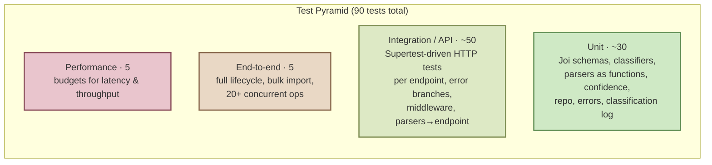

# Testing Guide

For QA engineers and contributors who need to run, extend, or verify the test suite. For endpoint specs see `API_REFERENCE.md`. For design rationale see `ARCHITECTURE.md`.

## At a glance

The suite is **90 tests across 9 files**, runs in **~3.5 seconds** without coverage, and gates merges at **≥85% coverage** on all four axes (statements / branches / functions / lines). Current coverage: **97 / 89 / 100 / 98**.

## Test pyramid



The pyramid is shape-correct, not size-correct: most tests are fast unit/integration, with a thin top layer of e2e + performance tests that protect cross-cutting properties.

## Test inventory

| File | Tests | Layer | What it covers |
|---|---|---|---|
| `tests/test_ticket_model.test.js` | 9 | Unit | Joi schema validation: required fields, length bounds, enum values |
| `tests/test_ticket_api.test.js` | 11 | API | All CRUD endpoints via Supertest |
| `tests/test_import_csv.test.js` | 6 | Mixed | `parseCsv` directly + `POST /tickets/import` with CSV |
| `tests/test_import_json.test.js` | 5 | Mixed | `parseJson` + import endpoint with JSON |
| `tests/test_import_xml.test.js` | 5 | Mixed | `parseXml` + import endpoint with XML (incl. xml2js single-child quirks) |
| `tests/test_categorization.test.js` | 10 | Mixed | Classifiers as pure fns (K1–K7) + auto-classify endpoint + manual override (K8–K10) |
| `tests/test_integration.test.js` | 5 | E2E | Full lifecycle, 50-row bulk import, **25 concurrent POSTs**, combined filters |
| `tests/test_performance.test.js` | 5 | Performance | Wall-clock budgets for import, latency, concurrency, auto-classify |
| `tests/test_coverage_gaps.test.js` | 34 | Mixed | Targeted branch coverage: parser fallbacks, repo edges, error class defaults, app-level middleware, classification log FIFO eviction, PUT-override branches |

## How to run tests

All commands run from `homework-2/`.

```bash
npm install                                         # first time
npm test                                            # full suite, no coverage instrumentation (~3.5 s)
npm run test:coverage                               # full suite + coverage report + 85% gate
npx jest tests/test_ticket_api.test.js              # one file
npx jest -t "T7"                                    # one test by name fragment
npx jest -t "K10"                                   # plan-mandated test by code
npx jest --watch                                    # auto-rerun the relevant tests on file save
npx jest --runInBand                                # single worker (use if a flaky test bleeds state)
```

| Script | Coverage? | Threshold check? | Use when |
|---|---|---|---|
| `npm test` | no | no | iterating; you want the fastest feedback |
| `npm run test:coverage` | yes | yes | before commit / CI / submission |
| `npx jest <file>` | no | no | working on a single test file |
| `npx jest -t "<name>"` | no | no | drilling into one failing test |

After `npm run test:coverage`, the HTML report lands at `homework-2/coverage/lcov-report/index.html` (and a duplicate at `coverage/index.html` for newer Jest versions). The summary screenshot for the homework deliverable lives at `homework-2/docs/screenshots/test_coverage.png`.

## Test isolation

`tests/setup.js` runs after every test:

```js
const repo = require('../src/repositories/ticketRepository');
const classificationLog = require('../src/classification/classificationLog');

afterEach(() => {
  repo.clear();
  classificationLog.clear();
});
```

This is the seam that lets integration tests seed multiple tickets without bleeding into the next test. **If you remove it, expect non-deterministic failures** — particularly in `test_ticket_api.test.js` T4 (which asserts `total === 3` after seeding) and the integration tests that count tickets across multiple operations.

If you ever need to opt *out* of the cleanup for a specific test (rare), the only safe way is to re-seed the data inside that test rather than disable the global hook.

## Sample test data

All fixtures are under `tests/fixtures/`. They double as the homework's deliverable sample data — every row is generated to cover all enum values and exercise edge cases the parsers care about (commas in quoted descriptions, pipe-separated tags, empty cells folded out of `metadata`).

| File | Bytes | Contents |
|---|---|---|
| `valid_tickets.csv` | 10,134 | 50 rows, every category × priority × status × source × device_type at least once; every 5th row has a comma-in-description; every 4th row has pipe-separated tags |
| `valid_tickets.json` | 10,080 | 20-element array with the same field coverage |
| `valid_tickets.xml` | 17,954 | 30 `<ticket>` children with nested `<metadata>` and multi-`<tag>` blocks |
| `invalid_tickets.csv` | 3,639 | 10 rows, one defect per row: bad email, oversized subject, empty description, short description, oversized description, invalid category enum, invalid priority enum, invalid status enum, invalid `metadata.source` enum, missing `customer_id` |
| `malformed.csv` | 43 | Unterminated quote on row 2 — used to test parser `ParseError` |
| `malformed.json` | 15 | `{ "tickets": [` — truncated |
| `malformed.xml` | 58 | `<tickets>` and `<ticket>` open, never closed |
| `single_ticket.json` | 312 | One object (not an array) — exercises parser's wrap-to-array path |

To regenerate (rare — only needed if the schema changes), `tests/fixtures/` was created with the inline script preserved in the homework-2 commit history.

## Performance benchmarks

All five tests in `tests/test_performance.test.js` enforce wall-clock budgets. Measured on a typical development machine (Apple Silicon, idle):

| Test | Budget | Typical | Headroom | Protects |
|---|---|---|---|---|
| **P1**: 1,000-row CSV import | < 5,000 ms | ~190 ms | 26× | Parser + per-row validation throughput |
| **P2**: 100 sequential POSTs avg | < 50 ms / req | ~1.7 ms / req | 29× | Single-request latency under no load |
| **P3**: 100 sequential GETs avg | < 20 ms / req | ~1.0 ms / req | 20× | Read-path latency, repo lookup cost |
| **P4**: 100 concurrent mixed reads/writes | < 10,000 ms | ~60 ms | 165× | Event-loop fairness; no race on Map writes |
| **P5**: 100 sequential auto-classify avg | < 100 ms / req | ~1.0 ms / req | 100× | Classifier + log write throughput |

The headroom is intentional. Budgets are set to catch **regressions**, not to prove peak performance — even a 10× slowdown still leaves them passing, which means flaky CI runners or shared dev machines won't false-positive.

If a performance test fails, **measure first, don't tune blindly**. Run the operation in isolation with `Date.now()` deltas to confirm the regression is real before touching the production code.

## Manual testing checklist

Use these sequences to spot-check the system in Postman or `curl` after a non-trivial change. Each row is a one-liner you should be able to run independently — no implicit setup. Replace `<id>` with a UUID returned by an earlier POST.

### CRUD happy path

| # | Request | Expect |
|---|---|---|
| 1 | `POST /tickets` with the [example body](#data-model) | `201`, response includes `id`, `created_at`, `status: "new"`, `priority: "medium"` |
| 2 | `GET /tickets` | `200`, `total: 1` |
| 3 | `GET /tickets/<id>` | `200`, full ticket object |
| 4 | `PUT /tickets/<id>` with `{"status": "resolved"}` | `200`, `resolved_at` is non-null, `updated_at` bumped |
| 5 | `DELETE /tickets/<id>` | `204`, empty body |
| 6 | `GET /tickets/<id>` | `404`, `{"error":"Ticket not found"}` |

### Validation paths

| # | Request | Expect |
|---|---|---|
| 7 | `POST /tickets` with `{"customer_email": "nope"}` | `400`, `details` references `customer_email` |
| 8 | `POST /tickets` missing `subject` | `400`, `details` references `subject` |
| 9 | `PUT /tickets/<id>` with `{}` | `400`, `details: ["No fields to update"]` |
| 10 | `GET /tickets/not-a-uuid` | `400`, `details: ["\"id\" must be a valid UUID"]` |
| 11 | `GET /tickets?priority=super_urgent` | `400`, `details` lists allowed values |

### Filtering and pagination

Seed three tickets with mixed `category`, `priority`, `customer_id`. Then:

| # | Request | Expect |
|---|---|---|
| 12 | `GET /tickets?category=billing_question` | `total` matches the seeded billing count |
| 13 | `GET /tickets?priority=urgent` | only urgent tickets returned |
| 14 | `GET /tickets?customer_id=c1` | only that customer's tickets |
| 15 | `GET /tickets?limit=2&offset=0` | `data.length: 2`, `total` reflects all matches |
| 16 | `GET /tickets?category=technical_issue&priority=high` | only tickets matching both predicates |

### Bulk import

| # | Request | Expect |
|---|---|---|
| 17 | `POST /tickets/import` with `tests/fixtures/valid_tickets.csv` | `200`, `total: 50, successful: 50, failed: 0` |
| 18 | Same with `valid_tickets.json` | `200`, `total: 20, successful: 20` |
| 19 | Same with `valid_tickets.xml` | `200`, `total: 30, successful: 30` |
| 20 | `POST /tickets/import` with `invalid_tickets.csv` | `400`, `failed: 10`, errors list with per-row indexes |
| 21 | `POST /tickets/import` with `malformed.json` | `400`, `{"error": "Malformed JSON: ..."}` |
| 22 | `POST /tickets/import` with a `.txt` file | `415`, unsupported file type |
| 23 | `POST /tickets/import?auto_classify=true` with `valid_tickets.csv` | `200`, every imported ticket has `category` and `classified_at` set |

### Auto-classification

| # | Request | Expect |
|---|---|---|
| 24 | `POST /tickets/<id>/auto-classify` on a ticket whose subject says `"can't access"` | `200`, `priority: "urgent"`, `confidence > 0` |
| 25 | `POST /tickets?auto_classify=true` with rich keyword text | `201`, `category` and `priority` set by classifier, `classification_confidence` non-null |
| 26 | `POST /tickets?auto_classify=true` with `priority: "low"` in the body | `201`, `priority: "low"` (manual wins), `classification_confidence: null` |
| 27 | `PUT /tickets/<id>` with `{"category": "feature_request"}` on an auto-classified ticket | `200`, `classification_confidence: null` (override clears it) |

### Edge cases worth covering manually

| # | Request | Expect |
|---|---|---|
| 28 | Upload a 12 MB file | `413`, `{"error": "File exceeds 10 MB limit"}` |
| 29 | `POST /tickets` with `Content-Type: application/json` and body `{bad` | `400`, `{"error": "Malformed JSON body"}` |
| 30 | `GET /not-a-route` | `404`, `{"error": "Not Found"}` |
| 31 | `POST /tickets` with the body containing `classification_confidence: 0.99` | `201`, but the response shows `classification_confidence: null` (silently stripped) |

## Adding a new test

1. Pick the right file:
   - HTTP-level → `test_ticket_api.test.js`
   - Schema-only → `test_ticket_model.test.js`
   - Specific parser format → `test_import_<format>.test.js`
   - Classifier behavior → `test_categorization.test.js`
   - Multi-step workflow → `test_integration.test.js`
   - Latency / throughput → `test_performance.test.js`
2. Use Supertest only when the test needs to exercise HTTP-level behavior (status codes, response shape, middleware). For pure module logic, `require()` the module directly — it's faster and the failure mode is more pinpointed.
3. The global `afterEach` in `tests/setup.js` already clears the repository and classification log between tests. Don't duplicate that cleanup inside individual tests.
4. Aim for one `expect()` per behavioral claim. Multiple `expect()`s in a test are fine when they jointly assert one outcome (e.g., status code + body shape + side effect on another endpoint).
5. Coverage doesn't care which test produced which line. If a new branch isn't getting hit by your normal test, move it to `test_coverage_gaps.test.js` rather than contorting an integration test.

## Reproducing the coverage screenshot

```bash
cd homework-2
npm run test:coverage
open coverage/lcov-report/index.html
```

The summary table at the top of the page is what to capture for `docs/screenshots/test_coverage.png`. All four headline percentages must read ≥85% — currently they all do (97 / 89 / 100 / 98).

If a future change drops any axis below 85%, the `coverageThreshold` block in `jest.config.js` makes Jest exit with a non-zero status, which fails CI before the screenshot question even comes up.
