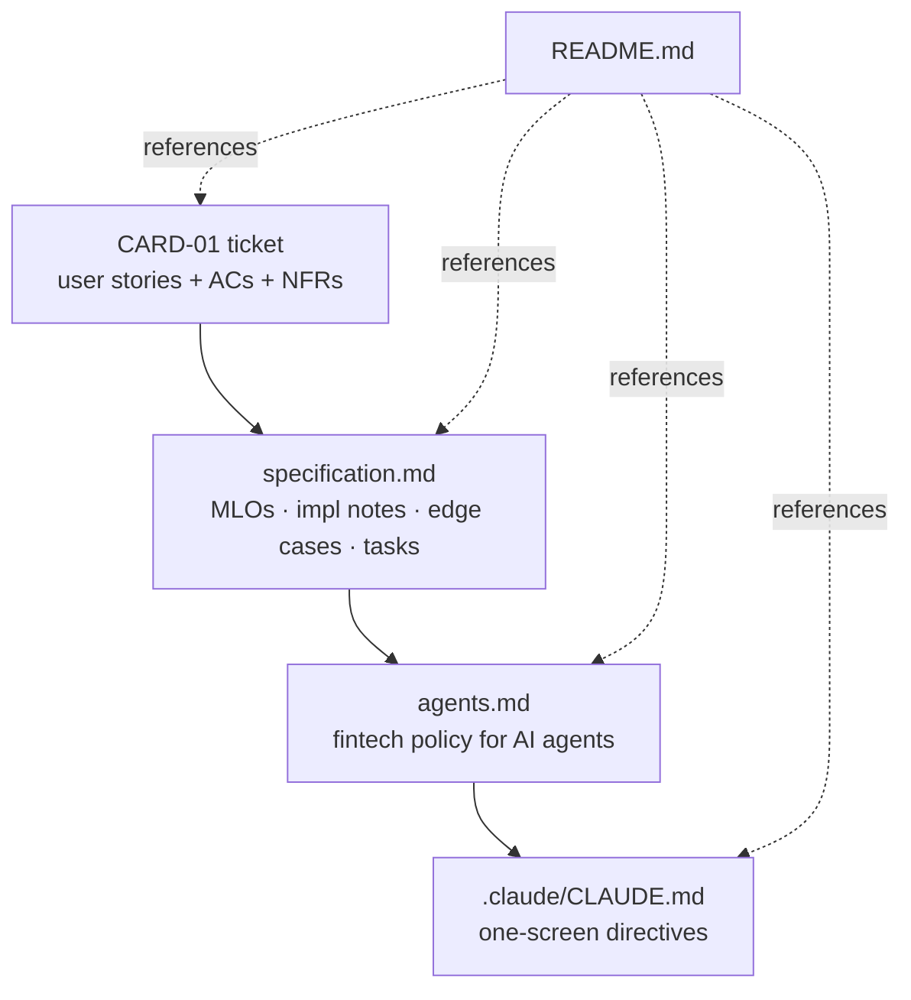

# 🧊 Homework 3: Specification-Driven Design — Virtual Card Freeze & Unfreeze

> **Student Name**: Alona Holovko
> **Date Submitted**: _[to be filled]_
> **AI Tools Used**: Claude Code

---

## Project Overview

A specification package — **no production code** — that designs a virtual card freeze/unfreeze capability for a regulated fintech. The deliverable is a layered, traceable document set: a product ticket feeds a structured specification with explicit High- and Mid-Level Objectives, non-functional targets, implementation notes, beginning/ending context, and per-task low-level prompts; that specification informs `agents.md`, a directive policy file binding any AI coding agent to fintech-grade rules (PAN handling, idempotency, audit, authorization, concurrency, processor compensation); `agents.md` is then distilled into a one-screen `.claude/CLAUDE.md` read by Claude Code on every interaction. The package is coherent by construction — every rule in `agents.md` traces back to an MLO or an explicit `[Domain default]`, every edge case has a defined post-state and verification approach, and the layered structure prevents drift between strategic intent and tactical agent behavior.

### Key documents

- `CARD-01-virtual-card-freeze-unfreeze.md` — the product ticket (input: user stories, acceptance criteria, NFRs).
- `specification.md` — layered spec: High-Level Objective → Mid-Level Objectives (MLO-1…MLO-10) → Implementation Notes → Edge-Case Resolutions → Beginning/Ending Context → Low-Level Tasks (with prompts) → verification per task.
- `agents.md` — project policy for any AI coding agent: tech stack, fintech domain rules, code style, testing expectations, security & compliance constraints, edge-case defaults, self-check checklist.
- `.claude/CLAUDE.md` — concise directive rules read by Claude Code on every interaction; one-screen distillation of `agents.md`.
- `TASKS.md` — assignment brief.
- This README.

## Document set at a glance



## Rationale

- **Why this feature.** Freeze/unfreeze is narrow on the surface but rich in domain detail: a six-state model with terminal states, a per-card processor that must agree with local state, idempotency under retries, append-only audit before user-visible confirmation, role-segregated cardholder vs ops flows, and tight latency targets. That density yields a meaningful spec without sprawling beyond one feature.
- **How performance targets were chosen.** Freeze p95 ≤ 300ms (MLO-7) reflects the cardholder UX expectation that a fraud-response action feels instant. Processor ack p99 ≤ 2s (MLO-8) matches the 2s hard timeout in the processor client — the system cannot promise more than the dependency can deliver. 99.95% monthly availability (MLO-9) treats freeze as a tier-1 control: fraud response failure has direct financial and trust impact.
- **How verification depth was calibrated.** Every Mid-Level Objective is testable and traces to an AC or NFR line in the ticket. Every edge case in `specification.md` defines its post-state, response, audit rows, and notifications — `agents.md §4 Testing` then requires one test per AC bullet and one per edge-case row. Verification depth scales with risk: PAN leakage and post-processor-ack audit failure get explicit dedicated assertions; cosmetic copy gets a literal substring check (`"no further transactions"`).
- **Process: layered prompting + self-critique loops.** The package was built one layer at a time — ticket, then spec, then agent policy, then `.claude/CLAUDE.md`. After each layer a self-review pass surfaced gaps (missing compensation branch, unresolved idempotency-after-state-change semantics, ambiguous reconciler authority); proposed fixes were selectively applied to keep the spec definitive rather than exhaustive. A final cross-document consistency check confirmed that endpoint paths, error codes, state names, reason-code vocabulary, and timeout values match across all four files.

## Industry best practices applied

| Practice | Where it is encoded | Why it matters |
|---|---|---|
| PAN tokenization; never log/audit/emit PAN | `specification.md` §Implementation Notes (data privacy); `agents.md` §5 PAN handling; `.claude/CLAUDE.md` "PAN handling — non-negotiable" | PCI-DSS scope reduction — raw PAN outside the vault expands audit scope and breach blast radius. |
| Synchronous audit write before state commit | `specification.md` MLO-5 + §Implementation Notes (audit); `agents.md` §5 Audit; handler step 5 in `.claude/CLAUDE.md` | Compliance evidence must exist before the user is told the action succeeded; failure to audit must fail the call. |
| Idempotent state-changing endpoints with cached responses | `specification.md` MLO-2 + §Implementation Notes (idempotency); `agents.md` §5 Idempotency; `.claude/CLAUDE.md` "Idempotency" | Network retries on POSTs are inevitable; cached `(card_id, key)` responses prevent double-actions and surface body conflicts via 422. |
| Per-card advisory lock for concurrent state transitions | `specification.md` §Implementation Notes (concurrency); `agents.md` §5 Concurrency; `.claude/CLAUDE.md` handler step 1 | Serializes freeze/unfreeze races; 500ms acquisition timeout bounds tail latency under contention. |
| Compensating action on partial failure (audit fails after processor ack) | `specification.md` §Edge case resolutions (row 2); `agents.md` §3 step 5a + §6; `.claude/CLAUDE.md` handler step 5a | Prevents silent divergence between local state and processor truth; if compensation also fails, escalates to reconciler via `pending_processor_verification`. |
| Reconciliation job for processor divergence | `specification.md` MLO-10 + Low-Level Task 7; `agents.md` §5 Processor integration; `.claude/CLAUDE.md` "Reconciliation" | Closes the gap between best-effort distributed commits; reconciler may only auto-resolve `pending_processor_verification` matches — all other divergence pages on-call. |
| Role-based access for ops actions with mandatory controlled-vocabulary reason codes | `specification.md` MLO-3; `agents.md` §2 Initiators and authorization; `.claude/CLAUDE.md` "Authorization" | SOX/SOC2 traceability — ops privilege must be explicit, and every privileged action must carry a regulator-recognizable reason. |
| Tier-1 availability with explicit p95/p99 latency budgets | `specification.md` MLO-7/8/9; `agents.md` §4 (load test requirement); `.claude/CLAUDE.md` "Testing" | Encodes fraud-response UX into measurable SLOs and a 500 RPS / 10-minute load test, not aspirational prose. |
| Immutable, tamper-evident audit log with 7-year retention | `specification.md` §Implementation Notes (compliance); `agents.md` §5 Audit; `.claude/CLAUDE.md` "Audit" | SOX/SOC2 retention requirement; append-only WORM or hash-chained storage prevents after-the-fact rewriting of evidence. |
| Separation of cardholder-initiated vs ops-initiated freezes | `specification.md` MLO-1 (cardholder cannot unfreeze ops freeze) + §Edge case resolutions; `agents.md` §2 Card state model + §2 Reason codes; `.claude/CLAUDE.md` "State machine" + "Cardholder copy" | Prevents a compromised cardholder session from undoing an ops fraud freeze; ops reason codes and operator identity are never leaked into cardholder-facing payloads. |

## Document layout

```
homework-3/
├── CARD-01-virtual-card-freeze-unfreeze.md
├── specification.md
├── agents.md
├── TASKS.md
├── .claude/
│   └── CLAUDE.md
└── README.md
```

<div align="center">

_This project was completed as part of the AI-Assisted Development course._

</div>
